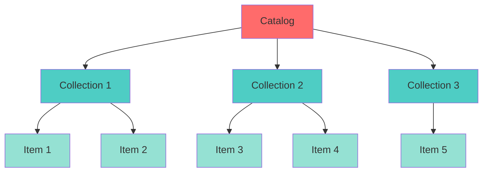

# STAC Hierarchy

The three core components

### 📚 Catalog
  - Top-level container
  - Groups related collections
  - Entry point for discovery

### 📂 Collection
  - Group of related items
  - Shared metadata (extent, license)
  - Describes what's inside

### 📄 Item
  - Individual asset (e.g., NetCDF file)
  - Specific time & space
  - Links to actual data

::right::

