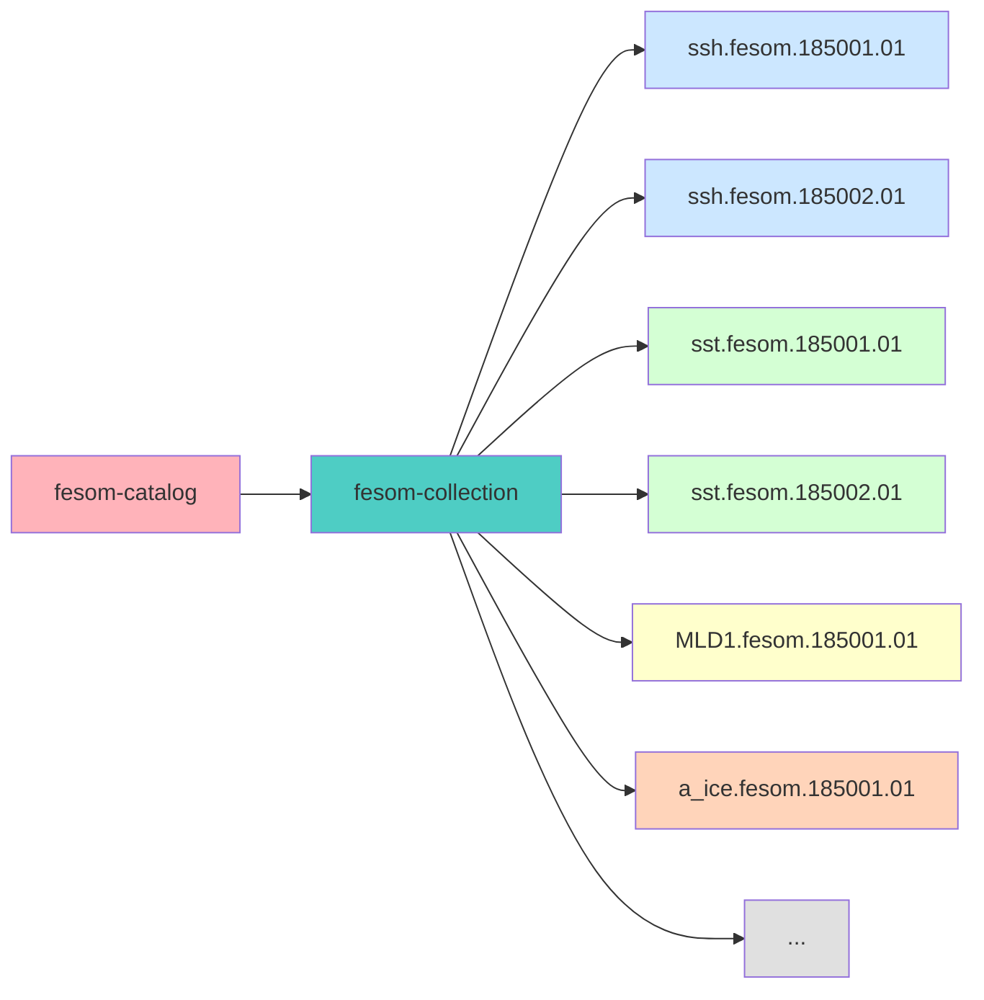

# Single Collection

All variables in one collection

### Structure
- **1 Catalog** → root
- **1 Collection** → all FESOM data
- **N Items** → all NetCDF files

### Characteristics
- Simple structure
- All data in one place
- Need to filter by variable

<b>Note:</b> per experiment level catalog

::right::

