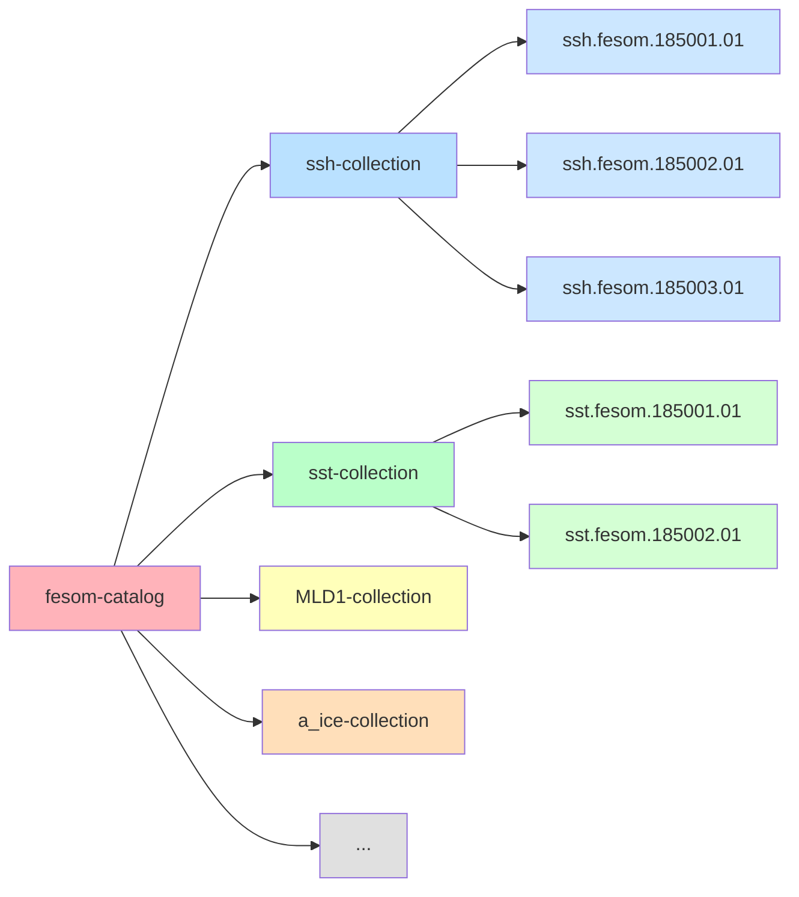

# Per-Variable Collections

One collection per variable type

### Structure
- **1 Catalog** → root
- **N Collections** → one per variable
- **M Items** → files for that variable

### Characteristics
- Variable-organized
- Direct access by variable
- No filtering needed

<b>Note:</b> per experiment level catalog

::right::

